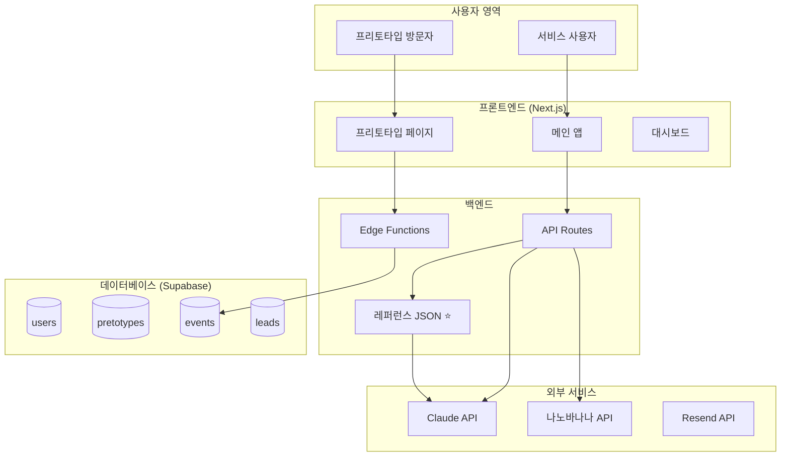

# FlashCheck

## 프리토타입 자동화 플랫폼

> **"상상은 그만, 10분 만에 증명하세요."**

---

## Master Specification Document

**Version 1.1** | AI 에이전트 개발용  
**레퍼런스 DB 기능 추가**  
**2026. 02. 02.**

---

## 검토 페르소나

| 페르소나 | 역할 | 검토 관점 |
|----------|------|-----------|
| Marty Cagan | SVPG 파트너, 『인스파이어드』 저자 | 프로덕트 본질 및 PRD 검토 |
| Martin Fowler | ThoughtWorks 수석 과학자 | 시스템 아키텍처 검토 |
| Eric Ries | 『린 스타트업』 저자 | MVP 전략 및 로드맵 검토 |

---

## 목차 (Table of Contents)

1. [서비스 개요 (Service Overview)](#1-서비스-개요-service-overview)
2. [제품 요구사항 명세서 (PRD)](#2-제품-요구사항-명세서-prd)
3. [레퍼런스 DB 시스템 ⭐ NEW](#3-레퍼런스-db-시스템--new)
4. [기술 스택 (Tech Stack)](#4-기술-스택-tech-stack)
5. [시스템 구조 (System Architecture)](#5-시스템-구조-system-architecture)
6. [유저 흐름 구조 (User Flow)](#6-유저-흐름-구조-user-flow)
7. [데이터 흐름 구조 (Data Flow)](#7-데이터-흐름-구조-data-flow)
8. [부록: 검토 페르소나 의견](#8-부록-검토-페르소나-의견)

---

## 1. 서비스 개요 (Service Overview)

### 1.1 서비스 정체성

| 항목 | 내용 |
|------|------|
| **서비스명** | FlashCheck (플래시체크) |
| **슬로건** | "상상은 그만, 10분 만에 증명하세요." |
| **한 줄 정의** | 아이디어의 시장성을 코딩 없이 10분 만에 검증하는 프리토타입 자동화 플랫폼 |
| **핵심 컨셉** | 알베르토 사보이아의 『아이디어 불패의 법칙』 기반 프리토타입(Pretotype) 서비스화 |

### 1.2 해결하려는 문제

#### 문제 상황

창업가와 기획자들은 새로운 아이디어가 떠오르면 흥분에 휩싸여 곧바로 개발에 착수합니다. 몇 개월의 시간과 수천만 원의 비용을 쏟아부은 후에야 "아무도 이걸 원하지 않았다"는 사실을 깨닫습니다.

#### 핵심 원인

- **검증 방법 부재:** "이거 나오면 살래?"라는 질문은 무의미합니다. 사람들은 예의상 "응"이라고 답합니다.
- **검증 비용 과다:** 랜딩페이지 제작, 광고 집행, 데이터 분석에 전문 지식과 시간이 필요합니다.
- **법적 리스크 우려:** "가짜 구매 버튼"이 사기로 오인될까 두려워 시도조차 못합니다.

#### 본질적 문제 정의

> **"아이디어가 될지 안 될지 모르는 상태에서, 확인할 방법 없이 도박을 해야 하는 것"**

### 1.3 해결 방안

#### 핵심 컨셉: 프리토타입(Pretotype) vs 프로토타입(Prototype)

| 구분 | 프로토타입(Prototype) | 프리토타입(Pretotype) |
|------|----------------------|----------------------|
| **핵심 질문** | "이것을 만들 수 있는가?" | "이것을 만들어야 하는가?" |
| **검증 대상** | 기술적 구현 가능성 | 시장성 (시장 수요) |
| **투자 비용** | 높음 (개발 필요) | 낮음 (파사드만 제작) |
| **검증 방식** | 작동하는 제품 시연 | 가짜 문(Fake Door) 클릭 데이터 |

#### FlashCheck의 접근법

1. **XYZ 가설 입력:** 복잡한 기획서 대신 "누가(X), 무엇을(Y), 얼마에(Z)" 세 가지만 입력
2. **레퍼런스 기반 AI 생성:** 검증된 고성과 랜딩페이지 패턴을 학습한 AI가 카피 생성 ⭐
3. **AI 이미지 생성:** 나노바나나 API로 제품 이미지 즉시 생성
4. **법적 안전장치 내장:** "사전 예약" 프레이밍, 개인정보 동의, 푸터 고지 자동 적용
5. **트래픽 주입:** 광고 소재 자동 생성 + 타겟 고객에게 노출 (Phase 2)
6. **데이터 기반 판정:** 클릭률, 전환율을 분석해 "Go/Drop" 판정 제공

### 1.4 핵심 가치 제안 (Core Value Proposition)

| 가치 | 설명 | 기존 대비 개선 |
|------|------|---------------|
| **Speed (속도)** | 10분 안에 검증용 랜딩페이지 완성 | 기존 1~2주 → 10분 (100배 단축) |
| **Quality (품질)** | 검증된 고성과 패턴 기반 AI 생성 ⭐ | 일반적 AI → 레퍼런스 학습 AI |
| **Validation (검증)** | "의견"이 아닌 "행동 데이터"로 시장성 확인 | 주관적 설문 → 객관적 클릭 데이터 |
| **Safety (안전)** | 법적 리스크 없는 "가짜 문" 설계 | 결제 기능 원천 배제, 고지 자동화 |

### 1.5 타겟 사용자

#### 1차 타겟: 마케터 & 기획자

- 신규 캠페인, 프로모션, 제품 아이디어의 반응을 사전 테스트하고 싶은 실무자
- A/B 테스트, 전환율 개념에 익숙하여 서비스 가치를 즉시 이해
- 회사 예산으로 빠르게 의사결정 가능

#### 2차 타겟: 예비 창업가 & 1인 메이커

- 아이디어는 있지만 개발 전 검증이 필요한 직장인, 학생, 사이드 프로젝터
- 코딩 능력이 없어도 아이디어를 테스트할 수 있는 도구 필요

#### 핵심 Job-to-be-Done

> **"내 아이디어에 진짜 돈을 낼 사람이 있는지, 개발하기 전에 확인하고 싶다"**

### 1.6 경쟁 환경 및 차별점

| 기존 대안 | 한계 | FlashCheck 차별점 |
|----------|------|-------------------|
| 랜딩페이지 빌더 (Wix, Carrd) | 페이지만 생성, 트래픽은 스스로 | 트래픽 부스터로 방문자 주입 |
| 광고 대행사 | 비용 높음, 소규모 테스트 부적합 | 소액(3~5만원)으로 즉시 테스트 |
| 설문조사 | "의견"만 수집, 실제 구매 의지와 괴리 | 실제 클릭 = Skin in the Game |
| 노코드 툴 (Bubble 등) | 학습 곡선 높음, 배포 복잡 | XYZ 입력만으로 즉시 배포 |
| 일반 AI 카피라이팅 | 맥락 없는 일반적 문구 생성 | 고성과 레퍼런스 기반 카피 ⭐ |

---

## 2. 제품 요구사항 명세서 (PRD)

**Version:** 1.1 | **Status:** Approved for MVP | **Owner:** Product Team

### 2.1 배경 및 목적 (Context & Goal)

#### 배경 (Background)

예비 창업가들은 아이디어 검증을 위해 랜딩 페이지 제작, 도메인 연결, 결제 모듈 연동 등에 불필요한 리소스를 낭비합니다. 이 진입 장벽 때문에 검증 없이 개발에 착수하고, 결국 실패합니다.

#### 제품 목표 (Product Goal)

> "10줄의 텍스트(가설)"를 "검증된 패턴 기반의 고품질 검증 사이트"로 10분 이내에 변환하여, 사용자가 'Skin in the Game(실제 행동 데이터)'를 즉시 확보하게 돕는다.

#### 핵심 성과 지표 (KPI)

| 지표 | 목표 | 측정 방법 |
|------|------|----------|
| Time to Deploy | 가설 입력부터 배포까지 10분 미만 | 사용자 세션 로그 분석 |
| Completion Rate | 시작한 사용자의 60% 이상 배포 완료 | Funnel 분석 |
| Copy Quality Score | 레퍼런스 기반 생성 vs 일반 생성 A/B 비교 ⭐ | CTR 비교 테스트 |
| Data Reliability | 봇 제외 실제 유효 클릭 데이터 정확도 99%+ | User-Agent 필터링 후 검증 |
| User Satisfaction | NPS 40 이상 | 배포 완료 후 설문 |

### 2.2 주요 사용자 스토리 (User Stories)

#### A. 가설 설정 및 생성 (Creation)

- "사용자는 XYZ 가설 포맷에 맞춰 아이디어를 입력할 수 있어야 한다."
- "AI는 입력된 업종/타겟에 맞는 고성과 레퍼런스 패턴을 참고하여 카피를 생성해야 한다." ⭐
- "사용자는 AI가 생성한 결과물을 미리보기에서 확인하고, '재생성' 버튼으로 수정할 수 있어야 한다."

#### B. 가짜 문(Fake Door) 경험 (Validation)

- "방문자는 실제 서비스처럼 '사전 예약' 버튼을 클릭할 수 있어야 한다."
- "버튼 클릭 시, 실제 결제가 진행되는 대신 '서비스 준비 중' 모달이 뜨고, 보상을 제안받아야 한다."
- **[Critical]** "시스템은 이 '클릭' 행위를 '전환(Conversion)' 데이터로 별도 저장해야 한다."

#### C. 결과 분석 (Insights)

- "사용자는 대시보드에서 노출 수, 클릭 수, 클릭률(CTR), 이메일 확보 수를 실시간으로 확인할 수 있어야 한다."
- "AI는 수집된 데이터를 바탕으로 'Go(진행)' / 'Drop(폐기)' 중 하나의 명확한 조언을 제공해야 한다."

### 2.3 기능 요구사항 (Functional Requirements)

| 우선순위 | 기능명 | 상세 설명 | 비고 |
|---------|--------|----------|------|
| **P0 (Must)** | 레퍼런스 기반 AI Generator ⭐ | 업종별 고성과 패턴을 참고한 카피 생성 | 레퍼런스 DB 연동 |
| **P0 (Must)** | AI Image Generator | 제품 컨셉에 맞는 고품질 이미지 생성 | 나노바나나 API |
| **P0 (Must)** | One-Click Deploy | flashcheck.site/[slug] 즉시 배포 | Vercel Wildcard |
| **P0 (Must)** | Event Tracking | page_view, button_click, form_submit 수집 | Supabase Edge Function |
| **P0 (Must)** | Safety Protocol | 사전 예약 프레이밍, 개인정보 동의, 푸터 고지 | 법적 필수 |
| **P1 (Should)** | Email Collector | "출시 알림 받기" 폼 및 DB 저장 | 리드 수집용 |
| **P1 (Should)** | Real-time Dashboard | 방문자 수, 클릭 수 실시간 표시 | Supabase Realtime |
| **P1 (Should)** | Go/Drop Verdict | 데이터 기반 AI 판정 제공 | Claude API |
| **P2 (Could)** | 80/20 Editor | 텍스트/이미지 인라인 수정 기능 | 완벽주의 방지 UX |
| **P2 (Could)** | Traffic Booster | 광고 소재 자동 생성 및 Meta API 연동 | Phase 2 BM |

### 2.4 안전 및 법적 프로토콜 (Safety Protocol)

> ⚠️ **이 프로토콜은 서비스의 법적 안전성을 위해 반드시 준수해야 합니다.**

#### ① 결제 기능 원천 배제 (No Charge Policy)

- 어떠한 경우에도 실제 결제 승인이 발생해서는 안 됨
- 카드 번호 수집 금지, 클릭 이벤트만 트래킹
- PG사 연동 코드 작성 금지

#### ② '사전 예약' 프레이밍

- **버튼 명칭:** '즉시 구매' 대신 `[사전 예약 특가]` 또는 `[출시 알림 받기]` 사용
- **클릭 후 메시지:** "현재 출시 준비 중입니다. 이메일을 남겨주시면 가장 먼저 알려드리겠습니다."

#### ③ 명시적 고지 (Disclaimer)

- **푸터 고지:** "본 페이지는 시장 수요 조사를 위한 테스트 페이지입니다" 자동 삽입
- **개인정보 동의:** 이메일 수집 시 `[개인정보 수집 및 이용 동의]` 체크박스 필수

### 2.5 제외 사항 (Out of Scope for MVP)

- 사용자 정의 도메인 연결 (Custom Domain)
- 복잡한 다중 페이지 구성 (싱글 랜딩 페이지만 지원)
- A/B 테스트 자동화
- Meta 광고 API 자동 연동 (Phase 2 이후)
- 레퍼런스 실시간 검색 (Phase 2 이후, MVP는 내부 데이터셋 활용)

---

## 3. 레퍼런스 DB 시스템 ⭐ NEW

> **AI가 "좋은 랜딩페이지가 뭔지" 알고 만드는 것과 모르고 만드는 건 천지 차이입니다.**

### 3.1 개요 및 목적

#### 레퍼런스 DB란?

검증된 고성과 랜딩페이지들의 구조, 카피라이팅 패턴, 설득 기법을 수집/분석하여 AI 생성의 품질을 높이기 위한 내부 데이터셋입니다.

#### 기존 방식 vs 레퍼런스 기반 방식

| 구분 | 기존 AI 생성 | 레퍼런스 기반 AI 생성 |
|------|-------------|---------------------|
| **프롬프트** | "다이어터용 떡볶이 카피 써줘" | "이 고성과 패턴 참고해서 써줘" |
| **결과물** | 일반적이고 평범한 문구 | 검증된 설득 패턴 적용 |
| **학습 기반** | 없음 (일반 지식만) | 업종별 50~100개 레퍼런스 |
| **CTR 기대치** | 평균 수준 | 상위권 기대 |

### 3.2 수집 대상 사이트

#### 해외 랜딩페이지 갤러리

| 사이트 | URL | 특징 | 수집 우선순위 |
|--------|-----|------|--------------|
| Landingfolio | landingfolio.com | 가장 큰 갤러리, 카테고리 잘 정리 | 상 |
| Lapa.ninja | lapa.ninja | 깔끔한 디자인 중심 | 상 |
| Land-book | land-book.com | SaaS 특화 | 중 |
| One Page Love | onepagelove.com | 원페이지 특화 | 중 |
| SaaS Pages | saaspages.xyz | SaaS 섹션별 분석 제공 | 상 |
| Screenlane | screenlane.com | 모바일/앱 포함 | 하 |

#### 한국 랜딩페이지 소스

| 사이트 | URL | 특징 | 수집 우선순위 |
|--------|-----|------|--------------|
| 와디즈 | wadiz.kr | 크라우드펀딩, 전환율 검증됨 | 상 |
| 텀블벅 | tumblbug.com | 크라우드펀딩, 창작 프로젝트 중심 | 상 |
| 클래스101 | class101.net | 교육 서비스 랜딩페이지 | 중 |
| 토스 | toss.im | 핀테크 랜딩페이지 벤치마크 | 중 |

### 3.3 수집할 데이터 구조

```typescript
LandingPageReference {
  // 기본 정보
  id: UUID
  source_url: string              // 원본 URL
  source_gallery: string          // 출처 (landingfolio, wadiz 등)
  screenshot_url: string          // 전체 페이지 스크린샷
  collected_at: timestamp
  
  // 분류 정보
  industry: string                // 업종 (SaaS, 이커머스, 교육, 금융, 식품, 건강...)
  sub_industry: string            // 세부 업종 (다이어트 식품, B2B SaaS 등)
  style: string                   // 스타일 (미니멀, 볼드, 일러스트, 사진 중심...)
  target_audience: string         // 타겟 (직장인, 학생, 주부, 시니어...)
  
  // 카피라이팅 분석 (핵심!)
  hero_headline: string           // 메인 헤드라인
  hero_subheadline: string        // 서브 헤드라인
  cta_text: string[]              // CTA 버튼 문구들
  value_propositions: string[]    // 가치 제안 문구들
  pain_points: string[]           // 고객 고통점 언급
  benefits: string[]              // 혜택 문구들
  social_proof_type: string[]     // 사회적 증거 유형 (후기, 로고, 숫자...)
  
  // 구조 분석
  sections: [                     // 섹션 순서와 유형
    { type: "hero", position: 1 },
    { type: "pain_point", position: 2 },
    { type: "solution", position: 3 },
    { type: "features", position: 4 },
    { type: "testimonials", position: 5 },
    { type: "pricing", position: 6 },
    { type: "faq", position: 7 },
    { type: "final_cta", position: 8 }
  ]
  
  // AI 분석 결과
  persuasion_techniques: string[] // 설득 기법 (공포 소구, 이익 소구, 희소성, 권위...)
  tone: string                    // 톤 (전문적, 친근한, 긴급한, 고급스러운...)
  emotional_triggers: string[]    // 감정 트리거 (FOMO, 신뢰, 호기심...)
  
  // 품질 지표 (가능한 경우)
  estimated_quality: string       // 상/중/하 (갤러리 피처드 여부 등으로 추정)
}
```

### 3.4 업종별 카테고리 분류

| 대분류 | 세부 분류 | 수집 목표 (MVP) |
|--------|----------|----------------|
| SaaS/소프트웨어 | B2B SaaS, B2C 앱, 생산성 도구, 마케팅 툴 | 20개 |
| 이커머스/제품 | 패션, 뷰티, 식품, 가전, D2C 브랜드 | 20개 |
| 교육/강의 | 온라인 강의, 코칭, 자격증, 어학 | 15개 |
| 건강/웰니스 | 다이어트, 피트니스, 보조제, 헬스케어 | 15개 |
| 금융/핀테크 | 투자, 보험, 대출, 자산관리 | 10개 |
| 크라우드펀딩 | 와디즈/텀블벅 성공 프로젝트 | 20개 |
| 기타 | 부동산, 여행, 이벤트, 비영리 | 10개 |

> **MVP 목표:** 총 110개 이상의 고품질 레퍼런스 확보

### 3.5 AI 연동 방식

#### 연동 플로우

```
[사용자가 XYZ 입력]
    │
    ▼
[1단계: 유사 레퍼런스 매칭]
    │
    ├── industry 매칭 (예: "식품" → 식품 관련 레퍼런스)
    ├── target_audience 매칭 (예: "다이어터" → 건강/웰니스 레퍼런스)
    ├── sub_industry 매칭 (예: "밀키트" → 식품 + 편의성)
    └── 상위 3~5개 레퍼런스 선정
    │
    ▼
[2단계: Claude 프롬프트 구성]
    │
    ├── 시스템 프롬프트: 역할 정의 + 출력 포맷
    ├── XYZ 가설: 사용자 입력값
    └── 레퍼런스 컨텍스트: 선정된 레퍼런스의 핵심 패턴
    │
    ▼
[3단계: 고품질 카피 생성]
```

#### 프롬프트 예시

```
당신은 전환율 최적화 전문 카피라이터입니다.
다음 XYZ 가설에 맞는 랜딩페이지 카피를 생성해주세요.

[XYZ 가설]
- 타겟(X): 다이어터
- 제품(Y): 곤약 떡볶이 밀키트
- 가격(Z): 15,000원

[참고할 고성과 레퍼런스 패턴]

레퍼런스 1 (다이어트 식품):
- 헤드라인: "맛있게 먹으면서 -5kg, 진짜 가능해요"
- CTA: "지금 시작하기"
- 설득기법: 결과 증명 + 의심 해소
- 톤: 친근하고 공감적

레퍼런스 2 (건강 밀키트):
- 헤드라인: "바쁜 당신을 위한 3분 건강식"
- CTA: "무료 배송 받기"
- 설득기법: 편의성 강조 + 시간 절약
- 톤: 실용적이고 직접적

레퍼런스 3 (와디즈 펀딩 성공작):
- 헤드라인: "다이어트 실패만 5번, 이젠 다릅니다"
- CTA: "얼리버드 혜택 받기"
- 설득기법: 공감 + 전환점 제시 + 희소성
- 톤: 스토리텔링

[지시사항]
위 레퍼런스의 설득 패턴과 톤을 참고하되, 그대로 복사하지 말고 
이 제품에 맞게 새롭게 작성해주세요.
JSON 포맷으로 출력해주세요.
```

### 3.6 수집 도구 구현 (Phase 1)

> MVP 단계에서는 자동화 스크래핑보다 **수동 큐레이션 + 반자동 분석**을 권장합니다.

#### 수집 프로세스

1. **수동 선별:** 갤러리 사이트에서 업종별 고품질 랜딩페이지 URL 수집
2. **스크린샷 캡처:** Puppeteer/Playwright로 전체 페이지 스크린샷
3. **텍스트 추출:** 헤드라인, CTA, 가치 제안 문구 추출
4. **AI 분석:** Claude로 설득 기법, 톤, 감정 트리거 자동 분류
5. **수동 검수:** 분류 결과 검토 및 품질 태깅
6. **JSON 저장:** 정제된 데이터를 레퍼런스 DB에 저장

#### 저장 방식 (MVP)

MVP에서는 DB 구축 대신 JSON 파일로 프로젝트 내 저장하여 프롬프트에 직접 포함합니다.

```
/data/references/
├── saas.json           // SaaS 업종 레퍼런스
├── ecommerce.json      // 이커머스 업종 레퍼런스
├── education.json      // 교육 업종 레퍼런스
├── health.json         // 건강/웰니스 업종 레퍼런스
├── finance.json        // 금융 업종 레퍼런스
├── crowdfunding.json   // 크라우드펀딩 레퍼런스
└── etc.json            // 기타 업종 레퍼런스
```

### 3.7 법적 고려사항

| 항목 | 권장 사항 | 위험도 |
|------|----------|--------|
| robots.txt | 각 사이트의 robots.txt 준수 | 중 |
| 저작권 | 카피 전체 복사 금지, 패턴/구조만 참고 | 상 |
| 개인정보 | 이메일, 전화번호 등 수집 금지 | 상 |
| 서버 부하 | rate limiting 적용 (요청 간 3초 이상) | 하 |
| 상업적 사용 | 스크린샷 외부 공개 금지, 내부 학습용만 | 중 |

> ⚠️ **핵심 원칙:** 레퍼런스의 "패턴"을 학습하되, "문구"를 그대로 복사하지 않습니다.

---

## 4. 기술 스택 (Tech Stack)

### 4.1 기술 스택 개요

| 구분 | 기술 | 선정 이유 |
|------|------|----------|
| **Frontend** | Next.js 14 (App Router) | SEO 최적화, RSC로 초기 로딩 속도 향상 |
| **Styling** | Tailwind CSS + Shadcn/ui | AI가 클래스 이름으로 디자인 통제 용이 |
| **Backend / DB** | Supabase | 인증, DB, 실시간 통합, 개발 시간 50%+ 단축 |
| **Hosting** | Vercel | Next.js 완벽 호환, Wildcard Subdomains |
| **AI (Copy)** | Claude API (claude-sonnet-4-20250514) | 레퍼런스 컨텍스트 기반 고품질 카피 생성 ⭐ |
| **AI (Image)** | 나노바나나 API | 제품 패키지 이미지 생성 |
| **Email** | Resend API | 이메일 발송, 무료 티어 충분 |
| **Analytics** | Supabase Edge Functions | 서버리스 이벤트 수집 |
| **Reference Data** | JSON Files (MVP) → Supabase (Phase 2) | 레퍼런스 DB 저장 ⭐ |

### 4.2 환경 변수 설정

```bash
# .env.local 예시
NEXT_PUBLIC_SUPABASE_URL=
NEXT_PUBLIC_SUPABASE_ANON_KEY=
SUPABASE_SERVICE_ROLE_KEY=
ANTHROPIC_API_KEY=
NANOBANANA_API_KEY=
RESEND_API_KEY=
```

---

## 5. 시스템 구조 (System Architecture)

### 5.1 전체 시스템 아키텍처



### 5.2 데이터베이스 스키마

#### pretotypes (프리토타입 프로젝트)

| 컬럼명 | 타입 | 설명 |
|--------|------|------|
| id | UUID (PK) | 프로젝트 고유 ID |
| user_id | UUID (FK) | 생성자 ID |
| slug | TEXT (Unique) | URL 슬러그 |
| hypothesis_xyz | JSONB | XYZ 가설 {target, product, price} |
| matched_industry | TEXT | 매칭된 업종 (레퍼런스 검색용) ⭐ |
| used_references | JSONB | 사용된 레퍼런스 ID 목록 ⭐ |
| generated_content | JSONB | AI 생성 콘텐츠 |
| image_url | TEXT | 생성된 이미지 URL |
| status | ENUM | draft \| published \| archived |
| created_at | TIMESTAMP | 생성 시각 |

#### events (행동 이벤트)

| 컬럼명 | 타입 | 설명 |
|--------|------|------|
| id | BIGINT (PK) | Auto Increment |
| pretotype_id | UUID (FK) | 프로젝트 ID |
| event_type | ENUM | page_view \| button_click \| form_submit |
| visitor_id | TEXT | 익명 방문자 ID |
| metadata | JSONB | {referrer, device_type, country} |
| created_at | TIMESTAMP | 이벤트 발생 시각 |

#### leads (리드/잠재고객)

| 컬럼명 | 타입 | 설명 |
|--------|------|------|
| id | BIGINT (PK) | Auto Increment |
| pretotype_id | UUID (FK) | 프로젝트 ID |
| email | TEXT | 수집된 이메일 |
| consent_agreed | BOOLEAN | 개인정보 동의 여부 |
| created_at | TIMESTAMP | 수집 시각 |

---

## 6. 유저 흐름 구조 (User Flow)

### 6.1 Creator's Journey (생성 및 배포)

| 단계 | 화면/액션 | 사용자 경험 | 핵심 기능 |
|------|----------|-------------|----------|
| 1. 로그인 | 로그인 페이지 | 소셜 로그인으로 빠르게 시작 | Supabase Auth |
| 2. XYZ 입력 | 가설 입력 폼 | "누가, 무엇을, 얼마에" 3가지만 입력 | 업종 자동 분류 ⭐ |
| 3. 레퍼런스 매칭 | (내부 처리) | 입력된 업종에 맞는 레퍼런스 선정 | 레퍼런스 DB 검색 ⭐ |
| 4. AI 생성 | 로딩 화면 | "고성과 패턴 분석 중..." 기대감 조성 | Claude + 레퍼런스 |
| 5. 미리보기 | 프리뷰 화면 | 생성된 페이지 확인 | 실시간 프리뷰 |
| 6. 배포 | 배포 버튼 | 원클릭으로 즉시 라이브 | Vercel Wildcard |
| 7. 분석 | 대시보드 | 실시간 데이터 확인, Go/Drop 판정 | Supabase Realtime |

### 6.2 핵심 UX 원칙

- **Don't Make Me Think:** 사용자의 고민 시간을 0으로 수렴
- **Mobile First:** 광고 유입의 95%가 모바일, 기본 뷰를 모바일로 고정
- **Pattern-Based Quality:** "AI가 알아서 잘 만들어준다"는 신뢰감 ⭐

---

## 7. 데이터 흐름 구조 (Data Flow)

### 7.1 레퍼런스 기반 AI 생성 데이터 흐름 ⭐

```
[사용자]
    │ XYZ 가설 입력 (타겟: 다이어터, 제품: 곤약 떡볶이, 가격: 15,000원)
    ▼
[Next.js API Route: /api/pretotype/generate]
    │
    ├── 1. 업종 분류
    │   └── "다이어터" + "떡볶이" → industry: "health", sub: "diet_food"
    │
    ├── 2. 레퍼런스 매칭
    │   └── /data/references/health.json 에서 상위 3개 선정
    │   └── 선정 기준: sub_industry 매칭 → target_audience 매칭 → quality 순
    │
    ├── 3. 프롬프트 구성
    │   ├── 시스템 프롬프트 (역할 정의)
    │   ├── XYZ 가설 (사용자 입력)
    │   └── 레퍼런스 컨텍스트 (선정된 3개 레퍼런스의 핵심 패턴)
    │
    ├── 4. Claude API 호출
    │   └── JSON Mode로 구조화된 응답 수신
    │
    ├── 5. 나노바나나 API 호출
    │   └── 제품 이미지 생성
    │
    ├── 6. Supabase DB 저장
    │   └── pretotypes 테이블 INSERT (used_references 포함)
    │
    ▼
[사용자]
    │ 고품질 카피가 적용된 미리보기 화면
```

### 7.2 이벤트 수집 데이터 흐름

```
[방문자 브라우저]
    │ 페이지 조회 / 버튼 클릭
    ▼
[Supabase Edge Function: /functions/track]
    │
    ├── 1. 봇 필터링 (User-Agent 분석)
    ├── 2. 이벤트 데이터 구성
    ├── 3. events 테이블 INSERT
    │
    ▼
[Supabase Realtime] → [대시보드 실시간 업데이트]
```

---

## 8. 부록: 검토 페르소나 의견

### 8.1 Marty Cagan (프로덕트 비저너리)

> "좋은 제품은 고객의 진짜 문제를 해결한다. 기능이 아니라 가치를 정의하라."

#### 강점

- 문제 정의가 명확함
- 핵심 가치(Speed, Quality, Validation, Safety)가 구체적이고 차별화됨
- 레퍼런스 DB 추가로 "Quality" 가치가 크게 강화됨 ⭐

#### 보완 의견

- 레퍼런스 기반 생성과 일반 생성의 품질 차이를 정량적으로 측정하는 A/B 테스트 필요

### 8.2 Martin Fowler (시스템 아키텍트)

> "좋은 아키텍처는 변경을 수용하고, 복잡성을 관리한다."

#### 강점

- MVP에서 JSON 파일로 시작하고 Phase 2에서 DB화하는 점진적 접근이 현명함
- used_references 필드로 어떤 레퍼런스가 효과적인지 추적 가능

#### 보완 의견

- 레퍼런스 JSON 파일이 커지면 빌드 시간에 영향을 줄 수 있으므로, 초기부터 lazy loading 고려

### 8.3 Eric Ries (린 스타트업 전략가)

> "Build-Measure-Learn 루프를 가장 빠르게 돌려라. 학습 속도가 경쟁력이다."

#### 강점

- Phase 0.5(레퍼런스 수집)를 별도 마일스톤으로 분리한 것이 적절함
- 수동 큐레이션 + 반자동 분석 방식이 MVP에 적합

#### 보완 의견

- **[강력 권장]** 레퍼런스 110개 전체를 수집하기 전에, 10개로 먼저 테스트하여 품질 향상 효과 검증
- 효과가 미미하면 레퍼런스 수집에 2주를 쓰지 말고 다른 가치에 집중

---

## End of Document

**FlashCheck Master Specification v1.1** | AI 에이전트 개발용  
**레퍼런스 DB 기능 추가** | 2026. 02. 02.